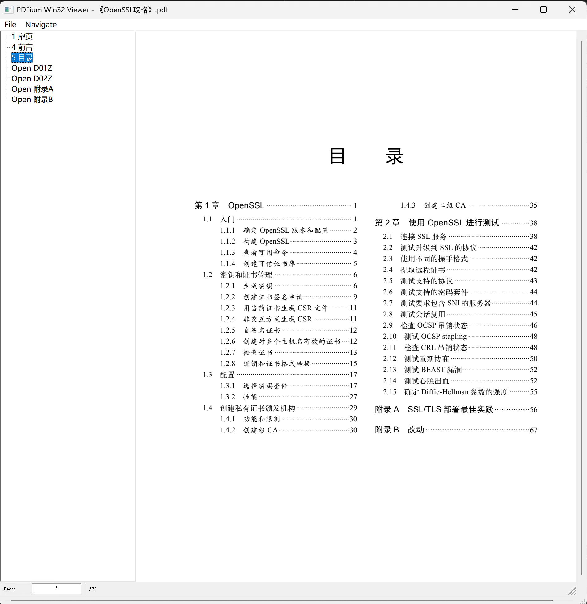

# PdfWinViewer 使用说明

一个基于 Windows SDK + PDFium 的最小 Win32 查看器（非 Qt）。支持：
- XFA/V8（取决于你的 PDFium 构建）
- 高 DPI 感知（Per‑Monitor V2）
- 文本清晰度优化（FPDF_LCD_TEXT）
- 水平/垂直滚动条
- Ctrl+滚轮缩放（以鼠标位置为锚点）
- 最近浏览（File → Recent…，存储于 %LOCALAPPDATA%\PdfWinViewer\recent.txt）

## 目录结构
```
PdfWinViewer/
  CMakeLists.txt          # CMake 构建脚本
  PdfWinViewer/
    Main.cpp              # Win32 查看器源码
```

## 先决条件
- Windows 10/11，Visual Studio 2022（v143 工具集）
- 已获取 PDFium 源码并完成依赖（depot_tools 等）
- 推荐在“VS 2022 开发者命令提示符”中执行以下命令

## 构建 PDFium（组件构建，生成 dll）
确保 `pdfium/out/XFA/args.gn` 至少包含：
```gn
is_debug = true
pdf_is_standalone = true
pdf_enable_v8 = true
pdf_enable_xfa = true
is_component_build = true   # 关键：生成 pdfium.dll
```
生成与编译：
```bat
cd /d D:\workspace\pdfium_20250814\pdfium
buildtools\win\gn.exe gen out\XFA
..\depot_tools\ninja.bat -C out\XFA pdfium
```
成功后应得到：`out\XFA\pdfium.dll` 与 `out\XFA\pdfium.dll.lib`。

## 构建 PdfWinViewer（CMake）
在同一命令行中执行：
```bat
cd /d <PdfWinViewer项目目录路径>
```

### 情况一：PdfWinViewer 和 pdfium 是同级目录
如果目录结构如下：
```
workspace/
├── PdfWinViewer/
└── pdfium/
```
直接执行：
```bat
cmake -S . -B build -G "Visual Studio 17 2022" -A x64
cmake --build build --config Debug --parallel
```

### 情况二：PdfWinViewer 和 pdfium 不是同级目录
如果目录结构不同，需要指定 PDFium 的路径：
```bat
cmake -S . -B build -G "Visual Studio 17 2022" -A x64 -DPDFIUM_ROOT=<pdfium目录路径>
cmake --build build --config Debug --parallel
```
例如：
```bat
cmake -S . -B build -G "Visual Studio 17 2022" -A x64 -DPDFIUM_ROOT=D:/workspace/pdfium_20250814/pdfium
cmake --build build --config Debug --parallel
```

可执行文件位置：`build\Debug\PdfWinViewer.exe`

> CMake 构建后会自动将 `out\XFA\*.dll` 拷贝到可执行目录；若仍有缺失，手动复制 `out\XFA` 下的所有 dll 即可。

### 不想本地构建？
- 你可以直接从历史提交获取已构建好的运行所需 DLL 文件：
  - 提交号：`89c1980`
  - 该提交包含 `build/Debug/` 下运行所需的 `*.dll`（例如 `pdfium.dll`、`v8*.dll` 等）与示例可执行文件，可用于快速运行验证。
  - 注意：仓库已在后续提交中清理了构建产物（通过 `.gitignore`），因此如需这些 DLL，请在 GitHub 上浏览该提交并下载对应二进制。

## IDE/.vscode 集成与脚本自动生成

### .vscode 自动生成与增量合并（支持 Cursor / CodeLLDB）
- 默认开启：`-DGENERATE_VSCODE=ON`。配置阶段：
  - 若工作区根目录不存在 `.vscode/launch.json`、`.vscode/tasks.json`，则根据模板自动生成；
  - 若已存在，则进行“增量合并”，不会覆盖你已有的配置：
    - `launch.json` 按 `name` 去重合并；
    - `tasks.json` 按 `label` 去重合并；
    - 合并脚本：`PdfWinViewer/tools/merge_json.ps1`（需要 `pwsh` 可执行）。
- 生成（或合并）后的内容特点：
  - 调试类型使用 `"type": "lldb"`，适配 Cursor（CodeLLDB）；
  - 预置两个调试配置：
    - `Debug PdfWinViewer (CodeLLDB)`（走 msbuild 任务）；
    - `Debug PdfWinViewer (CodeLLDB + CMake)`（走 CMake 任务）；
  - 预置两个任务：
    - `Build PdfWinViewer Debug x64`（调用 msbuild 脚本，见下节）；
    - `CMake Build Debug x64`（使用 VS2022 生成器构建 Debug 配置）。
- 强制重新生成方法（可选）：删除 `.vscode/launch.json` 或 `.vscode/tasks.json`，然后重新执行 CMake 配置。
- 关闭自动生成：`-DGENERATE_VSCODE=OFF`。

### msbuild 编译脚本（相对路径，可移植）
- 配置阶段自动生成（若文件不存在才生成，不会覆盖）：
  - `PdfWinViewer/msbuild_build_project_debug_x64.cmd`
- 脚本特点：
  - 使用 `%~dp0` 相对路径定位 `build/` 目录，移动工程目录后仍可使用；
  - 调用 VS 开发者环境：`VsDevCmd.bat -arch=amd64 -host_arch=amd64`；
  - 在构建前自动结束已运行的 `PdfWinViewer.exe`，避免 `LNK1168`；
  - 结束后检查 `build\Debug\PdfWinViewer.exe` 是否存在并输出结果（后者还带文件日志）。
- 与任务联动：`.vscode/tasks.json` 的 `Build PdfWinViewer Debug x64` 会调用上述脚本。
- 重新生成脚本：删除对应 `.cmd` 后重新执行 CMake 配置即可。
- 脚本使用：
  -PowerShell中执行： cmd /d /s /c "D:\workspace\pdfium_20250814\PdfWinViewer\msbuild_build_project_debug_x64.cmd"

### 依赖与注意事项
- 无需 PowerShell 7。合并器使用系统自带的 Windows PowerShell（`powershell.exe`），入口为 `PdfWinViewer/tools/merge_json.cmd`，实际调用同目录下的 `merge_json.ps1`；
- 如 VS 安装路径不同（Community/Enterprise），请在生成的任务或脚本中调整 `VsDevCmd.bat` 的路径；
- 模板中的 `@CMAKE_BUILD_TYPE@` 会在配置时替换为当前配置（如 `Debug`），保持与生成/调试配置一致。

## 运行
- 双击 `build\Debug\PdfWinViewer.exe`
- File → Open… 选择 PDF
- Ctrl+滚轮缩放，滚轮或滚动条滚动
- File → Recent… 可快速打开最近文件；“Clear Recent” 清空列表

## 项目展示

如下为应用运行截图（示例）：



## 一键复现/生成同类项目的 Prompt（可复制给 AI）
> 请将下述 Prompt 粘贴到支持代码生成/编辑的 AI 中（如 Cursor / GitHub Copilot Chat），AI 将基于 PDFium 生成一个 Win32 查看器并实现完整的右键导出功能与页码编辑等特性。

```
你是资深 Windows/Win32 + PDFium 开发助手。请在现有仓库基础上实现并保证以下功能稳定可用：

目标：基于 Win32 API（非 Qt）实现一个最小 PDF 查看器（支持 XFA/V8），并具备如下功能：
- 高 DPI（Per‑Monitor V2）；滚动条；Ctrl+滚轮缩放；FPDF_LCD_TEXT。
- 顶部菜单：File（Open…, Recent…/Clear Recent），Navigate（Prev/Next/First/Last/Goto…）。
- 状态栏页码：显示 “Page:” + 可编辑输入框 + “/ 总页数”；支持回车/失焦跳页，打开文档后自动聚焦到输入框；Home/End/PgUp/PgDn 可用。
- 打开文档：若已有文档先关闭；支持拖拽 PDF 到窗口打开；维护最近文件列表到 %LOCALAPPDATA%\PdfWinViewer\recent.txt。
- 右键菜单：
  - “导出当前页为 PNG…”：导出整页为 PNG（按当前窗口像素）。
  - “保存图片…”：点击命中图片对象，未命中回退为本页最大图片；优先用 `FPDFImageObj_GetBitmap` 得到原始像素，否则 `FPDFImageObj_GetRenderedBitmap` 渲染得到像素。
    - 无论得到哪种位图，都调用 `FPDFBitmap_GetFormat()`；若格式不是 32bpp BGRA（BGRA/BGRA_Premul 之外），将 `BGR/BGRx/Gray` 逐行转换为 32bpp BGRA 后再保存。
    - 用 GDI+ 以 32bpp ARGB 写入 PNG/JPEG，仅弹一次“保存为”对话框；新增防重入（避免双弹窗）；JPEG 保存失败回退 PNG。

实现细节与约束：
- 坚持单一保存对话框：在确认拿到有效像素后再弹框，拿不到像素不弹。
- 递归遍历 `FORM` 内嵌对象并应用对象矩阵，优先彩色对象；未命中回退最大图片。
- 重要 API：`FPDF_GetPageCount/LoadPage/ClosePage`，`FPDFImageObj_GetBitmap/GetRenderedBitmap/GetImageMetadata/GetImagePixelSize`，`FPDFBitmap_*` 系列，GDI+ `Bitmap::Save`。
- 稳定性：`CloseDoc()` 先退出 Form 环境再关文档；窗口销毁时清理；高 DPI 改变时重算尺寸与滚动条；多处加入防重入标志。
- 代码风格：清晰可读；提前返回；错误分支先处理；避免深嵌套；必要处加简明注释。

交付物：
- `PdfWinViewer/Main.cpp` 完整实现；
- README 中补充构建步骤、右键保存说明与以上 Prompt；
- 默认使用 VS2022 + CMake 构建，参数 `-DPDFIUM_ROOT` 和 `-DPDFIUM_OUT` 指向现有 PDFium。
```

> 小贴士：若你的系统禁用了 WIC JPEG 编码器，工程会自动回退为 PNG 保存；请确保对目标目录有写权限（避免 UAC 保护路径）。


## 常见问题
- 文本不清晰：已启用 `FPDF_LCD_TEXT`；若仍模糊，检查显示缩放与显卡驱动，或尝试将窗口放大以减少二次缩放。
- XFA 行为异常：确认 `args.gn` 已开启 `pdf_enable_xfa = true` 且在加载后调用了 `FPDF_LoadXFA`（本工程已自动处理）。
- 缺少 dll：从 `pdfium/out/XFA` 复制所有 `*.dll` 到可执行目录。
- 重新构建失败（LNK1168）：关闭正在运行的 `PdfWinViewer.exe` 后重试。

---

# English (Quick Guide)
A minimal Win32 PDF viewer using Windows SDK + PDFium. Features: high‑DPI, LCD text rendering, scrollbars, zoom (Ctrl+Wheel), XFA/V8 (if enabled), recent files.

## Build PDFium (component build)
Enable `is_component_build = true` in `out/XFA/args.gn`, then:
```bat
cd D:\workspace\pdfium_20250814\pdfium
buildtools\win\gn.exe gen out\XFA
..\depot_tools\ninja.bat -C out\XFA pdfium
```
It should produce `out\XFA\pdfium.dll` and `pdfium.dll.lib`.

## Build Viewer (CMake)
```bat
cd D:\workspace\pdfium_20250814\PdfWinViewer
cmake -S . -B build -G "Visual Studio 17 2022" -A x64 ^
  -DPDFIUM_ROOT=D:/workspace/pdfium_20250814/pdfium ^
  -DPDFIUM_OUT=D:/workspace/pdfium_20250814/pdfium/out/XFA
cmake --build build --config Debug --parallel
```
Run: `build\Debug\PdfWinViewer.exe`

DLLs from `out\XFA` are copied post‑build automatically. If anything is missing, copy all `*.dll` manually.
